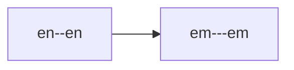

# Kitchen sink

Markdown syntax example for manual tests.

| Source | Rendered |
| ------ | -------- |
| `--`   | --       |
| `---`  | ---      |
| `...`  | ...      |
| `""`   | ""       |
| `''`   | ''       |

# Heading en--en

## Heading en--en

### Heading en--en

#### Heading en--en

##### Heading en--en

###### Heading en--en

## Bold, italics, highlights

*en--en*, **en--en**, ***en--en***

~~en--en~~

==en--en==

## Internal links

[[en--en]], [[en--en|note]]

## External links

[en--en](https://en--en.com/)

## Quotes

> `en--en`

## Lists

- en--en
  - en--en

1. en--en
2. en--en

- [ ] en--en

## Horizontal rule

---

## Code

`en--en`

```text
en--en
```

## Footnotes

Note[^en--en]

[^en--en]: en--en

## Comments

## Tables

| en--en |
| ------ |
| en--en |

## Diagrams



## Math

$en--en$

$$
en--en
$$

## Callouts

`en--en` → en--en

> [!NOTE] `en--en` → en--en
> `en--en` → en--en
>
> - `en--en` → en--en
>
>> [!NOTE] `en--en` → en--en
>> `en--en` → en--en

- `en--en` → en--en
- `en--en` → en--en
  > [!NOTE] `en--en` → en--en
  > `en--en` → en--en
  >
  > - `en--en` → en--en
  >
  >> [!NOTE] `en--en` → en--en
  >> `en--en` → en--en
